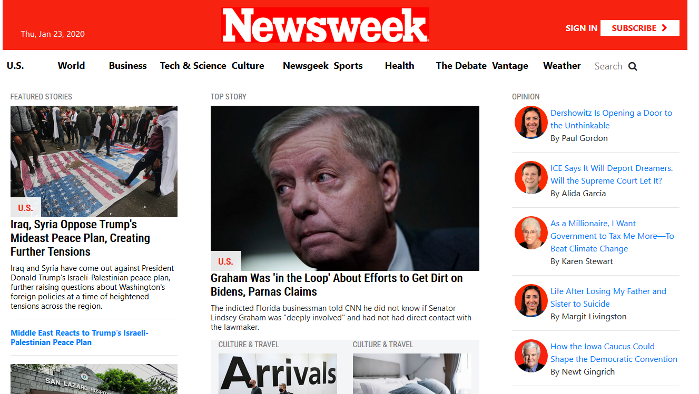

Using Bootstrap 4

This project requests students to build a replica of the news site Newsweek.com using the Bootstrap framework.

You can find the original project specification at: https://www.theodinproject.com/courses/html5-and-css3/lessons/using-bootstrap

Additional description about the project and its features.

Project anchor tags (links) are only simulations of what could be or would be a functional A tag (they are not meant to redirect only simulate.). 

Built With

- Bootstrap 4,
- HTML,
- CSS

Live Demo

[Live Demo Link](https://rawcdn.githack.com/dannisonarias/Bootstrap-Responsive-Design/3be1884e5fa1f9f2125aa19780df8a3a663fdf0a/index.html)

Getting Started

This project is a demonstration on my ability to use Bootstrap 4 to create a fully responsive website , Use to live Demo link above to take a look.

Authors

👤 **Dannison Arias**

- Github: [@dannisonarias](https://github.com/dannisonarias)
- Twitter: [@AriasDannison](https://twitter.com/AriasDannison)
- Linkedin: [Dannison Arias](https://www.linkedin.com/in/dannison-arias-777919190/)

👤 **Author2**

- Github: [@githubhandle](https://github.com/githubhandle)
- Twitter: [@twitterhandle](https://twitter.com/twitterhandle)
- Linkedin: [linkedin](https://linkedin.com/linkedinhandle)

## 🤝 Contributing

Contributions, issues and feature requests are welcome!

Feel free to check the [issues page](../../issues/).

## Show your support

Give a ⭐️ if you like this project!

## Acknowledgments

- Hat tip to anyone whose code was used
- Inspiration
- etc

## 📝 License

This project is [MIT](lic.url) licensed.
